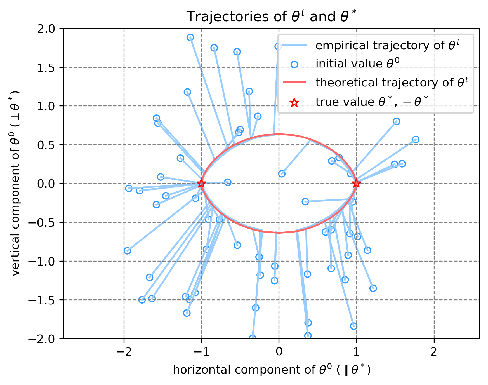
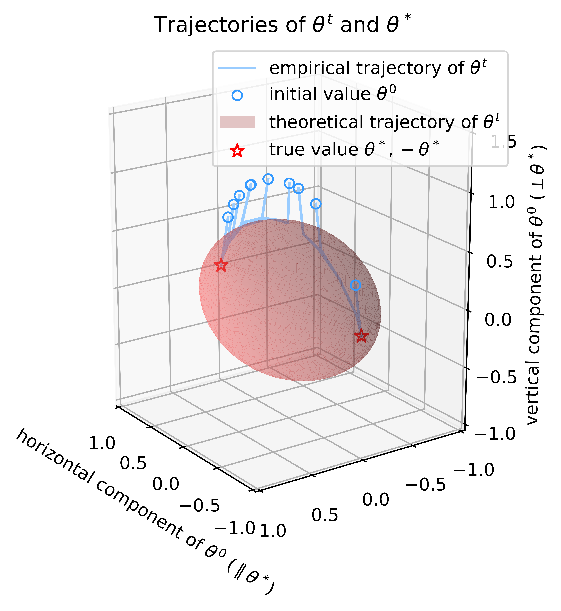
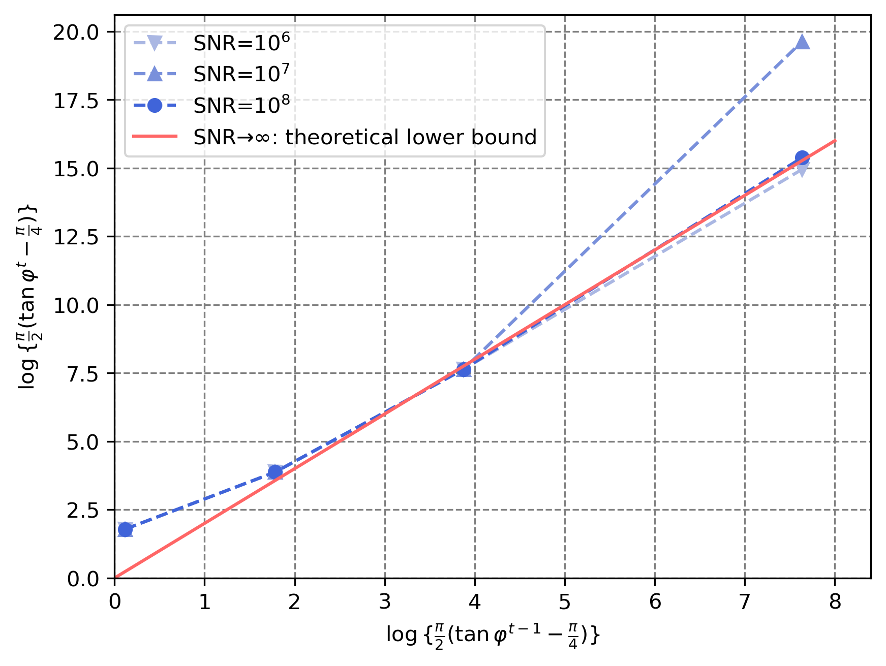
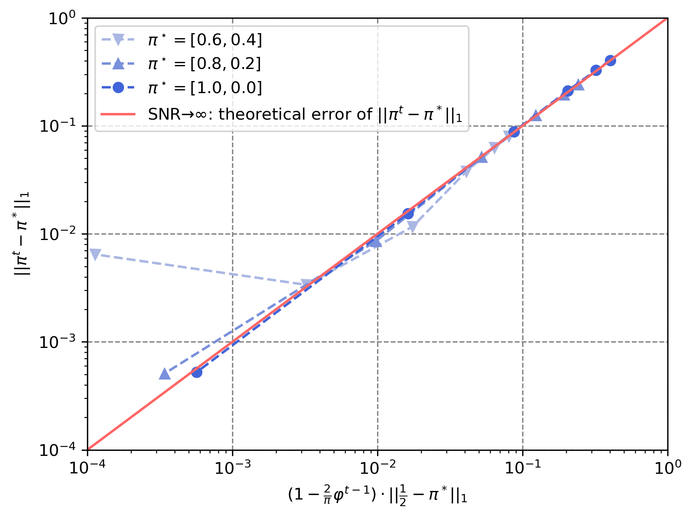
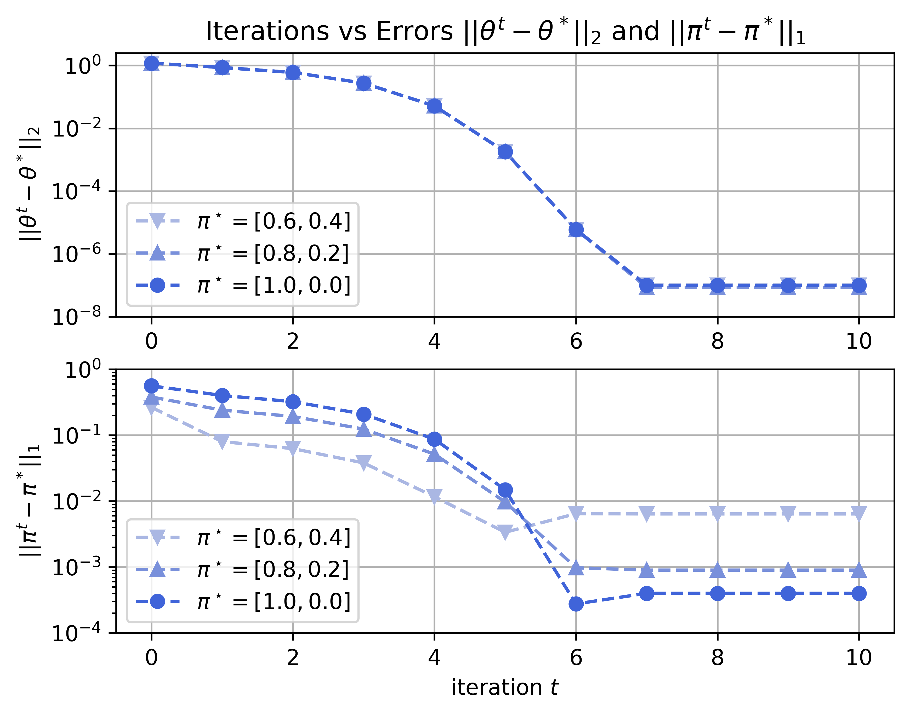

# Unveiling the Cycloid Trajectory of EM Iterations in Mixed Linear Regression

[](https://creativecommons.org/licenses/by/4.0/)

## Overview

This repository contains the code used for the experimental results in our paper:

**"Unveiling the Cycloid Trajectory of EM Iterations in Mixed Linear Regression"**

_Authors_: [Zhankun Luo](https://zhankunluo.com/), [Abolfazl Hashemi](https://abolfazlh.github.io/)  
_Conference_: International Conference on Machine Learning (ICML)  
_Year_: 2024

The paper can be accessed [here](link_to_paper).

## Abstract

We study the trajectory of iterations and the convergence rates of the Expectation-Maximization (EM) algorithm for two-component Mixed Linear Regression (2MLR).
The fundamental goal of MLR is to learn the regression models from unlabeled observations.
The EM algorithm finds extensive applications in solving the mixture of linear regressions.
Recent results have established the super-linear convergence of EM for 2MLR in the noiseless and high SNR settings under some assumptions and its global convergence rate with random initialization has been affirmed.
However, the exponent of convergence has not been theoretically estimated and the geometric properties of the trajectory of EM iterations are not well-understood. 
In this paper, first, using Bessel functions we provide explicit closed-form expressions for the EM updates under all SNR regimes. Then, 
in the noiseless setting, we completely characterize the behavior of EM iterations by deriving a recurrence relation at the population level and notably show that all the iterations lie on a certain cycloid.
Based on this new trajectory-based analysis, we exhibit the theoretical estimate for the exponent of super-linear convergence and further improve the statistical error bound at the finite-sample level.
Our analysis provides a new framework for studying the behavior of EM for Mixed Linear Regression.


## Table of Contents

- [Installation](#installation)
- [Experiments](#experiments)
- [Citation](#citation)
- [License](#license)
- [Acknowledgements](#acknowledgements)

## Installation

### Prerequisites

- Python >= 3.8
- Required libraries: [NumPy](https://numpy.org/), [Matplotlib](https://matplotlib.org/)

### Setup

Clone the repository:

```sh
git clone https://github.com/yourusername/your-repo-name.git
cd your-repo-name/code
```

## Experiments
Detailed instructions on how to reproduce the experiments from the paper.

### Experiment 1: Cycloid Trajectory of EM Iterations

To validate the Cycloid trajectories of EM iterations when $d=2, 3, 50$, use the following commands:
```sh
python trajectotry_dim2.py
python trajectotry_dim3.py
python trajectotry_dimhigh.py
```
The results are shown in the figure below.
<p align="center">
  
  
  2.png" alt="d=50" width="35%">
</p>


### Experiment 2: Quadratic Convergence for 2 Mixtures

To show the super-linear convergence under high SNR regimes, use the following command:
```sh
python superlinear.py
```
The convergence curves are shown below, the slopes of lines at different SNR values consistently hover around or slightly exceed 2. 


### Experiment 3: Error of Mixing Weights and Angle

To demonstrate the linear correlation between the error of mixing weights and the angle, use the following command:
```sh
python mixingweight.py
```
The experimental results are depicted in the following figure.


### Experiment 4: Comparison with Different Mixing Weights
To show that the EM update for regression parameters is independent of the true mixing weights, and the final error in mixing weights depends on the error in regression parameters and true mixing weights, use the following command:
```sh
python plot_iters.py
```
The experimental results align with our theoretical analysis, see the figures below.



## Citation
```bibtex
@inproceedings{luo2024cycloid,
  title={Unveiling the Cycloid Trajectory of EM Iterations in Mixed Linear Regression},
  author={Luo, Zhankun and Hashemi, Abolfazl},
  booktitle={Proceedings of the International Conference on Machine Learning (ICML)},
  year={2024}
}
```

## License

This project is licensed under the Creative Commons Attribution 4.0 International License. To view this license, visit [CC BY 4.0](https://creativecommons.org/licenses/by/4.0/).

## Acknowledgements
We are grateful to the ICML area chair and anonymous reviewers for their insightful input that improved the paper. 


